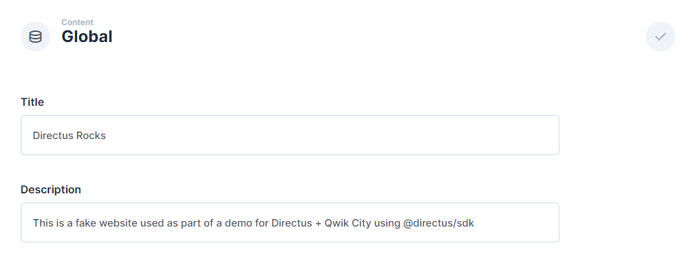

# Build a Website With Qwik City and the Directus JavaScript SDK

This guide shows you how to build a website with Qwik City and Directus as a Headless CMS.

[Qwik City](https://qwik.dev/docs/qwikcity/) is a popular JavaScript framework based on [Qwik](https://qwik.dev/docs/). In this tutorial, you will learn how to build a website using Directus as a [Headless CMS](https://directus.io/solutions/headless-cms). You will store, retrieve, and use global metadata such as the site title, create new pages dynamically based on Directus items, and build a blog.

## Before You Start

You will need:

- To install Node.js and a code editor on your computer.
- To sign up for a Directus Cloud account.
- Some knowledge of Vue.js and Nuxt.

Create a new Directus Cloud project - any tier and configuration is suitable for this tutorial.

Open your terminal and run the following commands to create a new Qwik City project and the Directus JavaScript SDK:

```bash
mkdir my-website
npm create qwik@latest
```

Answer the pre-install prompts as follows:

- `Where would you like to create your new project?` - `./my-website`
- `Select a starter` - `Empty App (Qwik City + Qwik)`
- `Would you like to install npm dependencies?` - `Yes`

Once finished, navigate into the new directory, install the dependencies, and install the Directus JavaScript SDK:

```bash
cd my-website
npm install
npm install @directus/sdk
```

Open `my-website` in your code editor and type `npm start` in your terminal to start the Qwik City development server and open [http://localhost:5173](http://localhost:5173) in your browser.

## Create a Helper for the SDK 

To share a single instance of the Directus JavaScript SDK between multiple pages in this project, create a single helper file that can be imported later. Create a new directory called `lib` and a new file called `directus.js` inside of it.

```js
import { createDirectus, rest } from '@directus/sdk';

const directus = createDirectus('https://directus.example.com').with(rest());

export default directus;
```

Ensure your Project URL is correct when initializing the Directus JavaScript SDK.

## Using Global Metadata and Settings 

In your Directus project, navigate to Settings -> Data Model and create a new collection called `global`. Under the Singleton option, select 'Treat as a single object', as this collection will have just a single entry containing global website metadata.

Create two text input fields - one with the key of `title` and one `description`.

Navigate to the content module and enter the global collection. Collections will generally display a list of items, but as a singleton, it will launch directly into the one-item form. Enter information in the title and description field and hit save.



By default, new collections are not accessible to the public. Navigate to Settings -> Access Control -> Public and give Read access to the Global collection.

Inside of the `src` directory, open up the `routes/index.tsx` file. Replace the contents with the following:

```jsx
import { component$ } from "@builder.io/qwik";
import type { DocumentHead } from "@builder.io/qwik-city";
import { routeLoader$ } from "@builder.io/qwik-city";

import directus from '../../lib/directus';
import { readItems } from '@directus/sdk';

export const useGetGlobals = routeLoader$(async () => {
  return directus.request(readItems("global"));
});

export default component$(() => {
  const global = useGetGlobals().value;
  return (
    <>
      <h1>{global.title}</h1>
      <p>{global.description}</p>
    </>
  );
});

export const head: DocumentHead = {
  title: "Directus Rocks",
  meta: [
    {
      name: "description",
      content: "This is a fake website used as part of a demo for Directus + Qwik City using @directus/sdk",
    },
  ],
};
```

Type `npm start` in your terminal to start the Qwik City development server and open [http://localhost:5173](http://localhost:5173) in your browser. You should see data from your Directus Global collection in your page.

## Creating Pages With Directus

## Creating Blog Posts With Directus

### Create Blog Post Listing

### Create Blog Post Pages

## Add Navigation

## Next Steps


